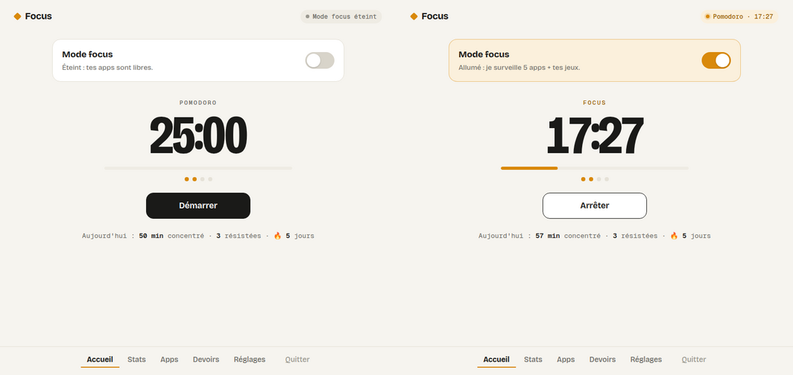
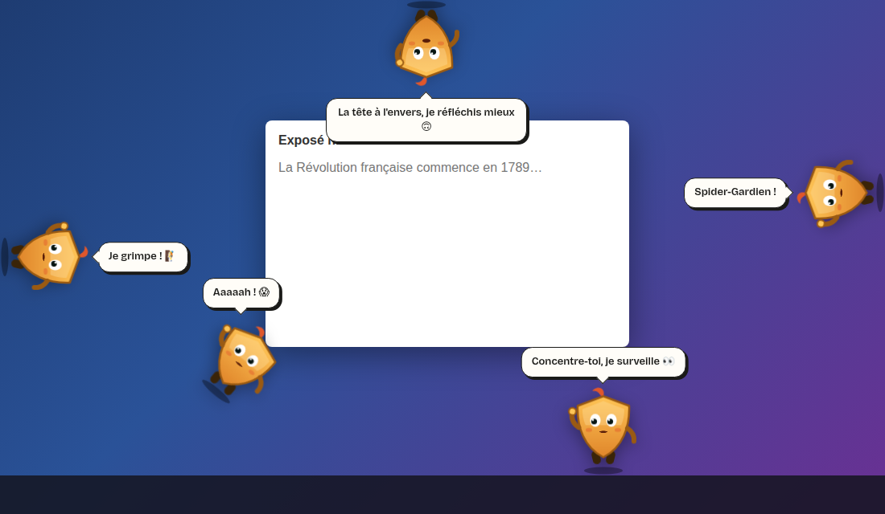
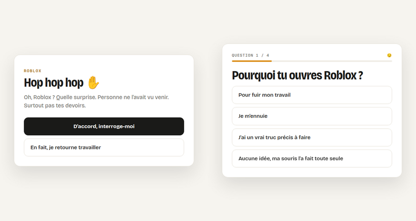
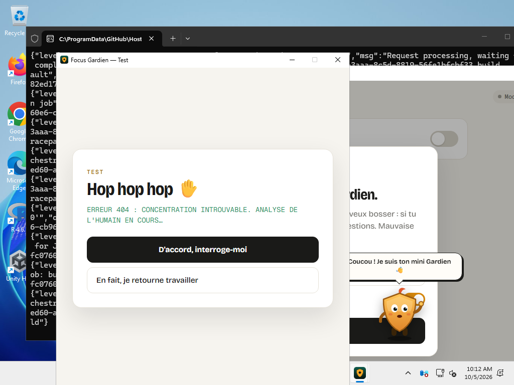

# Focus Gardien 🛡️

Une app Windows pour rester concentré. Allume le **mode focus** : si tu ouvres un jeu (ou une autre app que tu as
choisie), elle est mise en pause et le Gardien t'interroge, avec des blagues. Mauvaise réponse : l'app est fermée.

**[⬇️ Télécharger FocusGardien.exe](https://github.com/davidebonadeni5-droid/focus-gardien/releases/latest/download/FocusGardien.exe)**

## Installer

1. Télécharge **FocusGardien.exe** (lien ci-dessus) et mets-le où tu veux (par exemple dans `Documents`).
2. Double-clique dessus. Si Windows affiche « Windows a protégé votre ordinateur » : **Informations complémentaires** →
   **Exécuter quand même** (normal : l'app n'est pas signée par Microsoft).
3. Au premier lancement, choisis ton **mot de passe** : il faudra le donner pour quitter le Gardien.

**Plus jamais à réinstaller** : au démarrage puis toutes les 6 heures, l'app regarde s'il existe une nouvelle version
dans les [Releases](https://github.com/davidebonadeni5-droid/focus-gardien/releases), la télécharge, se remplace et se relance
toute seule (jamais pendant un Pomodoro). Le mini Gardien te l'annonce.

## Ce qu'il y a dedans

- **Mode focus** : le gros interrupteur de l'accueil (ou clic droit sur l'icône près de l'horloge).
  Éteint, tes apps sont libres. Allumé, je t'interroge avant d'ouvrir une app surveillée.
  Pendant le **travail d'un Pomodoro**, les apps surveillées sont bloquées même si le mode focus est éteint.
- **L'interrogatoire** : une blague (moqueur, coach, robot ou dramatique), 3 questions, une question de devoirs
  (calcul ou vocabulaire), 10 secondes de réflexion, puis le verdict : refusé, ou 5 à 15 minutes accordées.
- **Pomodoro** : 25 min de travail / 5 min de pause (réglable).
- **Mini Gardien** : il marche en bas de l'écran, **grimpe les bords**, **marche au plafond**, lâche prise et **tombe en
  rebondissant**. Attrape-le à la souris et **lance-le**. Clique pour qu'il parle, double-clique pour ouvrir l'app.
- **Stats** : minutes concentré et tentations résistées sur 14 jours, série de jours 🔥.
- **Apps** : les jeux sont déjà cochés (Steam, Epic, Roblox, Minecraft, Riot, Valorant, Fortnite…), plus tous les jeux
  des dossiers Steam, Epic, Riot, Ubisoft. Ajoute une app par son nom ou en cliquant sur un programme ouvert.
- **Devoirs** : ton vocabulaire pour la question bonus (`le chien (allemand) = der Hund`).
- **Réglages** : sons, mini Gardien, démarrage avec Windows, durées, mot de passe.

Fermer la fenêtre ne quitte pas le Gardien : il reste **près de l'horloge**. Pour vraiment le quitter : **Quitter** + mot de passe.

> Les sites web (YouTube dans Chrome, par exemple) ne sont pas surveillés, seulement les programmes.
> Tes données sont dans `%APPDATA%\FocusGardien`.

## Comment c'est construit

- `main.py` : fenêtres (pywebview + WebView2), icône près de l'horloge, démarrage avec Windows, mot de passe.
- `gardien.py` : détection des apps, pause / fermeture, Pomodoro, statistiques.
- `promenade.py` : déplacements du mini Gardien (marche, escalade, plafond, chute, lancer).
- `maj.py` : mises à jour automatiques depuis la dernière release.
- `ui/` : l'interface (HTML, CSS, JS), qui marche aussi dans un navigateur en mode démo.

À chaque push sur `main`, GitHub Actions construit `FocusGardien.exe` sur Windows, l'ouvre pour de vrai (fenêtre
principale, interrogatoire, mini Gardien transparent, capture d'écran) et publie une nouvelle release.

Depuis le code : Python 3.10+, `pip install -r requirements.txt`, puis `python main.py`.
Pour fabriquer le `.exe` sur ton PC : double-clic sur `construire_exe.bat`.

